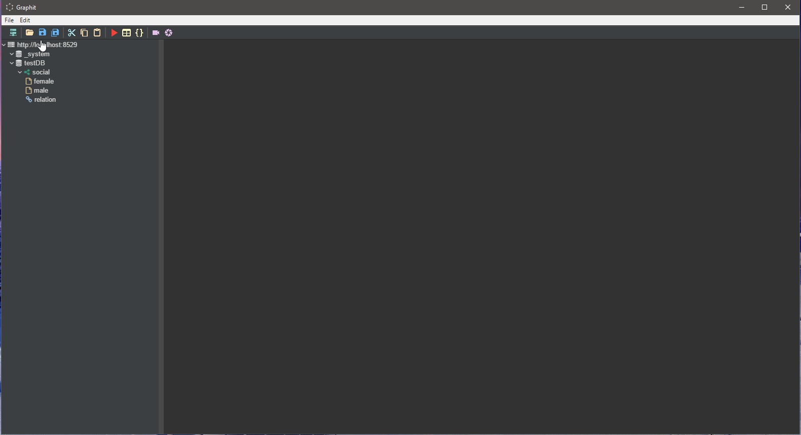
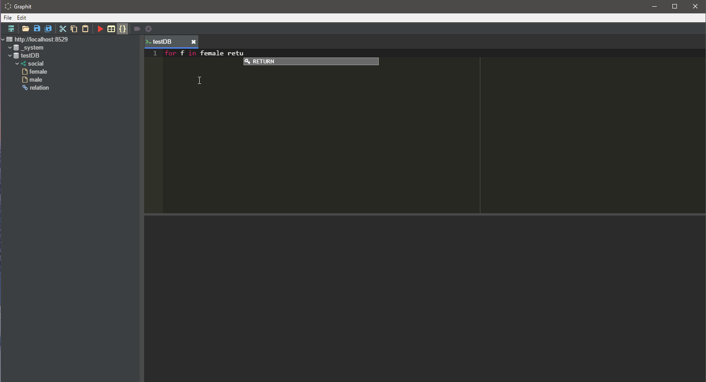
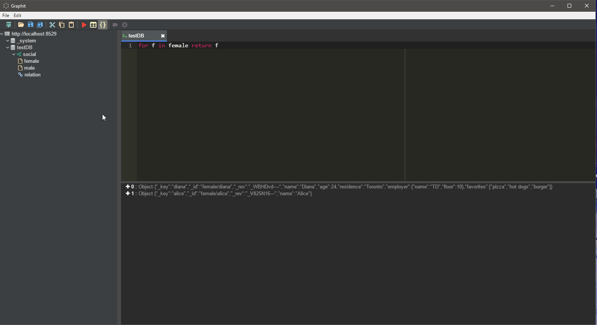
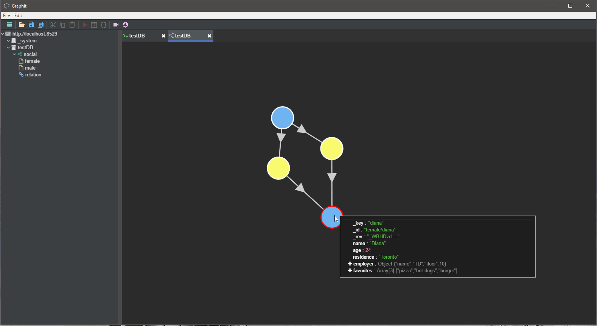

# arango-graphit - Intro

## Objectives
ArangoDB is a multi-data-model database which combines key-value storage, document storage as well as graph relations betwee the documents. This is a rather presumptuous attempt to create a tool which would help developers and database admins to manage arango databases. The primary focus of the project, at least for starters, is on graphs. In its first iteration, this management environment should provide the users with the following functionalities:

- Save/open AQL queries
- View database structure
- Compose and run AQL queries with the help of basic intelisense
- Add/remove databases, document collections, relation collections, graphs, graph vertex/relation collections, documents and relations
- Explore graphs of objects

## Screenshots

Home Screen: the left pane shows database and graph


AQL Editor with intellisense (very basic right now)


AQL results tab


Graph Explorer with object preview

## Inspirations
The project takes inspirations from a number of existing software such as:
- MS SQL Server Management Studio: layout of the UI components, database tree view, tabs layout
- Visual Studio Code: color scheme, tabs layout, tree view
- Jetbrains Webstorm and other Jetbrains products: color scheme, tan layout, tree view

## Technologies
- Electron
- Angular 2+
- Ace editor for AQL queries
- Cytoscape for graph visualizations
- Prme NG for some user controls


# Project Development

## Building the project for development
- Clone the repository
- Install the dependancies with 'npm install'
- To start the dev server: open a command window and run 'npm start'
- Copy the mode-aql.js file from the root directory into the newly buit 'dist' folder
- To start electron app: open another command window and run 'npm run electron:serve'
- The application should start in hot reload mode. Once you make any changes to the Angular app, electron will reload to reflect the changes. Keep in mind that the once you make any changes to the main process code, electron will not hot reload and you will have to manually restart step 5

### Known issues with the build process
- After installing the dependencies and try to run the app, you might run into the following error - "list" argument must be an Array of Buffers. The error is coming from node_modules/buffer.index.js, in the *concat* function even though the passed **buf** object is a *Buffer*:
```javascript
    if (!Buffer.isBuffer(buf)) {
      throw new TypeError('"list" argument must be an Array of Buffers')
    }
```
The issue can be corrected by commenting out the exception but will need to investigate a more reliable fix

## Primary outstanding features
- table view for aql queries
- graph label mappings
- live graph change updates
